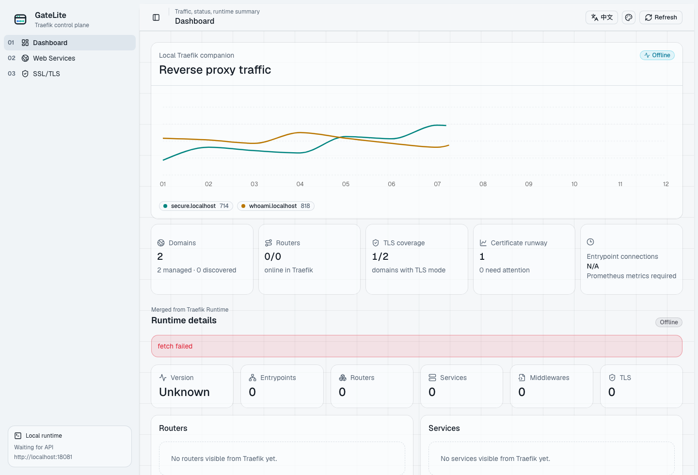
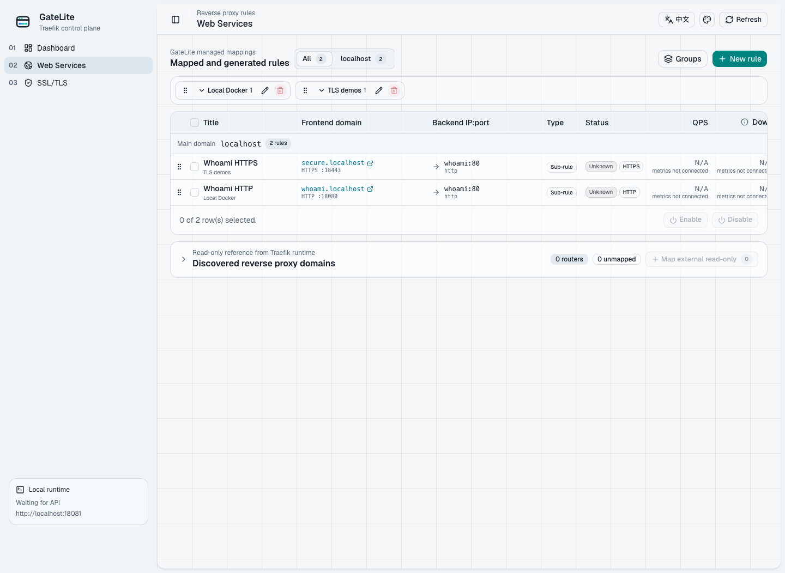
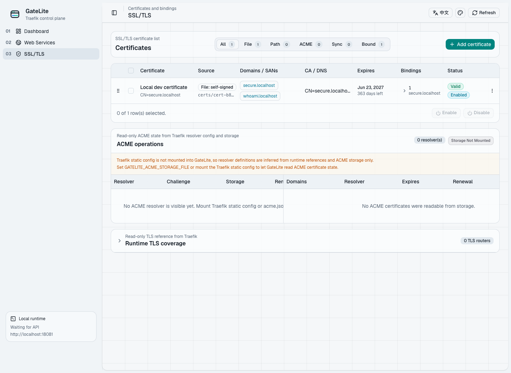

<div align="center">
  <picture>
    <source media="(prefers-color-scheme: dark)" srcset="public/brand/gatelite/horizontal-dark.svg">
    
  </picture>

  <p><strong>Turn Traefik domains, certificates, and route operations into a lightweight control plane.</strong></p>
  <p><strong>把 Traefik 的域名、证书和路由管理，变成一个轻量控制台。</strong></p>

  <p>
    <a href="LICENSE"></a>
    <a href="https://github.com/lizhelang/GateLite/releases/tag/v0.1.1"></a>
    <a href="https://github.com/users/lizhelang/packages/container/package/gatelite"></a>
    
    
    
  </p>

  <p>
    <a href="README.md">English</a> | <a href="README.zh-CN.md">简体中文</a>
  </p>
</div>

GateLite is a lightweight management panel for Traefik OSS. It aims to combine
Lucky-style ease of use, Traefik's underlying proxy capabilities, and a stable
API surface that AI agents and scripts can use safely.

GateLite is not a Traefik fork and does not replace Traefik core. It is a
companion control plane: Traefik continues to own reverse proxying, TLS, ACME,
Docker provider, file provider, Kubernetes integrations, and runtime routing.
GateLite stays above that layer and focuses on human-friendly workflows,
configuration generation, rollback, and agent-friendly automation.

## Core Users

- Humans who want to fill in a domain, backend address, and certificate method,
  then save without writing YAML first.
- AI agents and scripts that need stable APIs for creating, updating, deleting,
  and auditing routes without directly editing Traefik configuration files.

## Initial Product Scope

1. Web services / reverse proxy rules
   - Show which domains are currently in use.
   - Show each frontend domain, backend IP:port, downstream/upstream bytes, and
     live connection count in one dense rule row.
   - Connect each rule to its router, service, entrypoints, middleware chain,
     TLS mode, provider, and current health/config status.
   - Make common route creation feel closer to Lucky than raw Traefik YAML.

2. SSL/TLS certificate management
   - Provide guided certificate setup for beginners.
   - Support viewing certificate coverage, expiry, resolver/source, and
     associated domains.
   - Generate the needed Traefik dynamic or install configuration instead of
     forcing new users to write YAML at the start.

3. Traefik dashboard parity
   - Surface the information Traefik's own dashboard/API exposes: routers,
     services, middlewares, TLS objects, providers, entrypoints, and routing
     status across HTTP, TCP, and UDP where available.
   - Keep Traefik OSS as the runtime source of truth.

4. Agent API
   - Stable HTTP API for route and certificate workflows.
   - Explicit dry-run, diff, apply, and rollback operations.
   - Machine-readable validation errors so agents can repair requests without
     guessing.

## Non-Goals

- Forking Traefik.
- Reimplementing Traefik's proxy engine.
- Hiding advanced Traefik concepts when users need them.
- Making direct production changes without preview, validation, and rollback.

## Repository Status

This repository now contains the first local development module:

- React/Vite management frontend
- Express API companion
- Traefik file-provider configuration generation
- Local state history with rollback handles
- Docker Compose Traefik + whoami test environment
- Web services and SSL/TLS certificate management pages
- Optional built-in Basic/Bearer access control, disabled by default
- Optional Cloudflare DNS/DDNS management for declared records
- Backup/restore and release verification scripts

## Screenshots



| Web services | SSL/TLS certificates |
| --- | --- |
|  |  |

## Local Development

Install dependencies:

```bash
npm install
```

Start local Traefik and the sample backend:

```bash
npm run compose:up
```

Start GateLite:

```bash
npm run dev
```

Open:

- GateLite frontend: http://localhost:5173
- GateLite API: http://localhost:3001/api/health
- Traefik dashboard/API: http://localhost:18081
- Traefik Prometheus metrics: http://localhost:18081/metrics
- HTTP test route: http://whoami.localhost:18080
- HTTPS test route: https://secure.localhost:18443

The first server start creates local runtime state under `runtime/`, generates a
self-signed development certificate, and writes Traefik dynamic configuration
to `runtime/traefik/gatelite.yml`.

The local Traefik container enables Prometheus router/service metrics so the
GateLite overview can plot managed-domain request activity from real Traefik
counters instead of static preview data.

## Three-Minute Self-Hosted Start

Use this path when you already run Traefik with a Docker network, file provider
directory, and certificate directory.

1. Pull the release image:

   ```bash
   docker pull ghcr.io/lizhelang/gatelite:0.1.1
   ```

2. Copy `deploy/portainer/gatelite/docker-compose.yml` and set the values that
   match your environment:

   ```env
   GATELITE_IMAGE=ghcr.io/lizhelang/gatelite:0.1.1
   GATELITE_HOST=gatelite.example.com
   GATELITE_AUTH_ENABLED=true
   GATELITE_AUTH_USERNAME=admin
   GATELITE_AUTH_PASSWORD=<strong-password>
   ```

   Update the compose volume paths if your Traefik dynamic config and
   certificate directories are not `/data/compose/1/dynamic` and
   `/data/compose/1/certs`.

3. Start the stack, then verify it:

   ```bash
   docker compose up -d
   GATELITE_PUBLIC_URLS=https://gatelite.example.com npm run verify:domains
   ```

For offline installs, download the release `gatelite-<version>.tar.gz` artifact
and load it with `docker load < gatelite-<version>.tar.gz`.

Run checks:

```bash
npm run typecheck
npm run build
npm run test
npm run audit:prod
npm run verify:release
npm run verify:local
npm run verify:ui-i18n
npm run verify:crud
```

`npm run verify:local` assumes `npm run compose:up` and `npm run dev` are
already running. It checks the local Traefik API, the GateLite API connection,
the generated dynamic configuration, and both seeded HTTP/HTTPS whoami routes.
`npm run verify:ui-i18n` uses Playwright against the running GateLite frontend
to switch between Chinese and English and verify the core Web services and
SSL/TLS certificate labels, table columns, details/edit row actions, Web
service rule/sub-rule preview flows, browser PEM upload, and inline certificate
binding expansion.
`npm run verify:crud` uses temporary `*.localhost` domains to exercise Web
service, group, certificate, history rollback, create/edit/toggle/reorder/delete
flows against the same local Traefik stack, then removes those temporary
resources.

Release and operations helpers:

```bash
npm run backup
npm run restore -- <backup.tar.gz> --force
npm run verify:domains
```

`npm run backup` archives GateLite state, rollback snapshots, generated dynamic
config, and mounted certificates. `npm run verify:domains` checks the public
hosts listed in `GATELITE_PUBLIC_URLS`; set that variable to your own deployed
GateLite URLs before running the check. If built-in auth is enabled, also set
`GATELITE_VERIFY_AUTH_USERNAME` and `GATELITE_VERIFY_AUTH_PASSWORD` for the
HTML shell check.

## DNS/DDNS Management

GateLite can replace a small DDNS-Go style loop for Cloudflare records. It is
disabled by default and requires GateLite auth when enabled. Records are
configured as an explicit allowlist, and GateLite only creates or updates those
records; it does not delete DNS records or resolve A/CNAME conflicts for you.

See [docs/dns-management.md](docs/dns-management.md) for the environment
format and the current `zooe.cc` / `1804.surfacer.cc` migration shape.

## Certificate Ownership

GateLite is not a certificate authority, ACME client, or renewal daemon.
Traefik, Cloudflare, your DNS provider, and any DDNS tool remain responsible for
the parts they already own:

- Traefik owns TLS termination, ACME challenge execution, issuance, renewal, and
  the `acme.json` storage file.
- Cloudflare or another CDN may terminate browser-facing TLS before traffic
  reaches Traefik.
- DDNS tools update DNS records or public IP targets; they do not issue
  certificates. GateLite can take over that DNS update loop only when its
  Cloudflare DNS management feature is explicitly enabled.
- GateLite manages route-to-certificate intent, local PEM metadata, uploaded or
  synced PEM files under `GATELITE_CERT_DIR`, resolver references, and read-only
  ACME status display when Traefik config/storage are mounted into GateLite.

Do not store DNS provider API tokens in GateLite state. When GateLite owns
Cloudflare DDNS updates, keep those credentials in environment variables only;
they are not returned through the GateLite API or UI. Traefik still owns ACME
challenge credentials for certificate issuance.

Certificate deletion is metadata-only by default. Admin users can choose to
clean up GateLite-managed PEM files for `self-signed`, `upload`, and `sync`
certificates; `path` certificates and Traefik ACME storage are left alone.

## Access Control

GateLite access control is optional and off by default. To protect the browser
UI and API with built-in Basic auth:

```bash
GATELITE_AUTH_ENABLED=true
GATELITE_AUTH_USERNAME=admin
GATELITE_AUTH_PASSWORD=<strong-password>
```

API clients can use role-scoped Bearer tokens such as
`GATELITE_VIEWER_TOKEN`, `GATELITE_AGENT_TOKEN`, `GATELITE_OPERATOR_TOKEN`, and
`GATELITE_ADMIN_TOKEN`. See [security.md](docs/security.md).

## Release And Deployment

GateLite releases are project releases, not deployments of any maintainer's
private domains. When deploying your copy, point `GATELITE_HOST`,
`TRAEFIK_API_URL`, `GATELITE_DYNAMIC_FILE`, `GATELITE_CERT_DIR`, and optional
ACME observability mounts at your own Traefik environment. See
[domain-migration.md](docs/domain-migration.md) and [release.md](docs/release.md)
for the release gate, domain checks, versioning, and rollback procedure.

Useful Agent API endpoints:

- `GET /api/dashboard` returns runtime, Web service, certificate, traffic, and
  recent history data.
- `GET /api/web-services` returns groups, managed Web services, and discovered
  Traefik routes for route read workflows.
- `POST /api/web-services/preview`, `POST /api/web-services/:id/preview`,
  `POST /api/web-services/:id/delete-preview`, and
  `POST /api/discovered-routes/import-preview` are dry-runs that return current
  YAML, next YAML, and a compact generated-config diff without writing state.
- Mutating GateLite state endpoints return `{ data, apply }`. `apply` includes
  the action, summary, `historyId`, `rollbackId`, `rollbackAvailable`, and
  idempotency replay metadata when an idempotency key is supplied.
- Send `Idempotency-Key` or `X-Idempotency-Key` on state-changing
  `POST`/`PUT`/`PATCH`/`DELETE` requests. Reusing the same key with the same
  method, path, query, and body replays the saved apply response; reusing it for
  a different request returns `409` with `code: "IDEMPOTENCY_KEY_CONFLICT"`.
- Validation failures return `400` with `code: "VALIDATION_FAILED"` and
  structured `issues`.
- `GET /api/history` returns recent changes with `rollbackAvailable` flags.
- `POST /api/history/:id/rollback` restores the state snapshot captured before
  that change, regenerates Traefik dynamic config, and returns an apply result.

## References

- Traefik API and dashboard documentation:
  https://doc.traefik.io/traefik/operations/dashboard/
- Traefik dynamic routing configuration methods:
  https://doc.traefik.io/traefik/reference/routing-configuration/dynamic-configuration-methods/
- Traefik TLS documentation:
  https://doc.traefik.io/traefik/https/tls/
